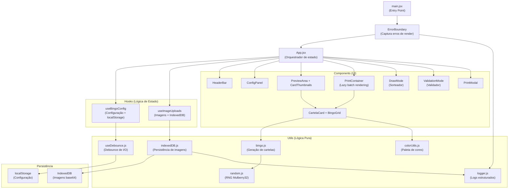

# Bringo 🎟️ - Gerador de Cartelas de Bingo


O **Bringo** é um sistema moderno, robusto e de alta performance desenvolvido para a geração, gerenciamento, sorteio e validação de cartelas de bingo. Projetado originalmente para o evento da **ADC Embraer**, o sistema garante a geração de até 20.000 cartelas físicas únicas e não repetitivas por lote diário.

Este repositório é composto por um frontend interativo desenvolvido em **React** (Vite + Tailwind CSS) e um backend persistente em **Python** (Flask + SQLite).

---

## 🚀 Funcionalidades Principais

*   **Geração Confiável e Única:** Garante a geração de cartelas 100% exclusivas através de verificação criptográfica (hash) no banco de dados SQLite.
*   **Customização Completa:**
    *   Títulos, subtítulos, regras e avisos do evento.
    *   Adição de múltiplos prêmios (de 1 a 6 prêmios, gerando grades correspondentes por cartela).
    *   Upload de logotipo principal e logos de patrocinadores no rodapé.
    *   Escolha do elemento central da grade (Estrela padrão, Logotipo do cabeçalho ou Imagem personalizada).
    *   Configuração de cores temáticas por prêmio (modo colorido) ou cor única.
*   **Modo de Impressão Otimizado:** Layout sob medida configurado para **2 cartelas por folha A4 em modo Paisagem**. Inclui renderização preguiçosa (*lazy loading* em lotes) para evitar lentidão e travamentos no navegador ao preparar milhares de páginas.
*   **Sorteador Integrado (Draw Mode):** Globo de sorteio eletrônico com controle de velocidade, auto-play e visualização de números chamados por coluna (B-I-N-G-O).
*   **Validador de Cartelas:** Sistema de validação em tempo real que verifica se determinada cartela é vencedora cruzando com a lista de números sorteados, buscando os dados persistidos no banco de dados SQLite (ou fallback offline).

---

## 🛠️ Tecnologias Utilizadas

### Frontend
*   **React 18** (Vite)
*   **Tailwind CSS v4** (Estilização responsiva e moderna)
*   **Material Web Components** (Campos de entrada e abas fluidas)
*   **Lucide React** (Pacote de ícones modernos)

### Backend
*   **Python 3**
*   **Flask** (API REST)
*   **SQLite** (Banco de dados leve e embarcado para persistência segura)

---

## 📦 Como Executar o Projeto

### Pré-requisitos
*   [Node.js](https://nodejs.org/) (v18 ou superior recomendado)
*   [Python 3](https://www.python.org/)

---

### 1. Executando o Backend (Servidor Flask + SQLite)

O backend é responsável por salvar as configurações, gerar as combinações de números com garantia de não repetição e gerenciar os lotes de cartelas.

No Windows, você pode simplesmente dar um duplo clique no arquivo iniciador:
```bash
backend/run_backend.bat
```
*(Esse script criará automaticamente o ambiente virtual Python `venv`, instalará as dependências do `requirements.txt` e iniciará o servidor na porta `5001`).*

#### Inicialização manual (Qualquer SO):
1. Acesse a pasta do backend:
   ```bash
   cd backend
   ```
2. Crie e ative o ambiente virtual:
   ```bash
   python -m venv venv
   # No Windows:
   venv\Scripts\activate
   # No macOS/Linux:
   source venv/bin/activate
   ```
3. Instale as dependências:
   ```bash
   pip install -r requirements.txt
   ```
4. Execute o servidor:
   ```bash
   python app.py
   ```
O servidor estará rodando em: `http://localhost:5001`

---

### 2. Executando o Frontend (React + Vite)

1. Certifique-se de estar na pasta raiz do projeto.
2. Instale as dependências do Node:
   ```bash
   npm install
   ```
3. Inicie o servidor de desenvolvimento:
   ```bash
   npm run dev
   ```
O frontend estará acessível em: `http://localhost:5173` (ou a porta exibida no terminal).

---

## ⚡ Melhorias de Performance Implementadas

O sistema foi otimizado para lidar com grandes volumes de dados (lotes de até 20.000 cartelas) sem travar a interface do usuário:

1.  **Renderização Lazy de Impressão:** Em vez de gerar milhares de elementos DOM ocultos no carregamento inicial, o `PrintContainer` monta e renderiza as cartelas em lote (chunks de 50 cartelas por frame) apenas quando o botão de impressão é clicado. Isso poupa gigabytes de memória RAM.
2.  **Memoização de Componentes:** Componentes de alto custo de renderização, como `CartelaCard`, `BingoGrid` e `PrizeGrid`, utilizam `React.memo` para evitar renderizações redundantes quando apenas as configurações de texto mudam.
3.  **Debounce em Inputs:** A digitação nos campos de configuração utiliza estados locais síncronos e realiza a atualização no banco de dados e no localStorage com técnicas de *debounce* (atraso intencional de 300ms/500ms), reduzindo as escritas em disco e requisições de rede.
4.  **Tree Shaking no Material Web:** Otimização dos imports do Material Web no `main.jsx` carregando apenas os módulos específicos necessários, reduzindo o tamanho final do bundle JS.
5.  **Cálculos Otimizados:** O pareamento de cartelas por página (`pairedCards`) e verificação de dados de fallback são envoltos em `useMemo`.

---

## 🖨️ Instruções para Impressão das Cartelas

1.  No painel lateral, vá na aba **Config** e insira a quantidade desejada de cartelas.
2.  Clique no botão **Imprimir Cartelas** no topo direito.
3.  Aguarde o progresso de preparação (o sistema irá gerar as cartelas em blocos para evitar travamentos).
4.  Quando o diálogo de impressão do navegador abrir:
    *   Defina o destino como **Salvar como PDF** ou selecione a sua impressora.
    *   Altere o layout para **Paisagem**.
    *   Em configurações avançadas, defina as **Margens** como **Nenhuma** para garantir que as duas cartelas se encaixem perfeitamente em uma única página A4.
    *   Certifique-se de que a opção **Gráficos de segundo plano** (Background graphics) esteja **marcada** para que as cores temáticas e logos apareçam corretamente.

---

## 🏗️ Arquitetura do Frontend



---

## 🧪 Testes

```bash
# Rodar todos os testes
npm run test

# Rodar em modo watch (desenvolvimento)
npm run test:watch

# Rodar com relatório de cobertura (mín. 70%)
npm run test:coverage
```

